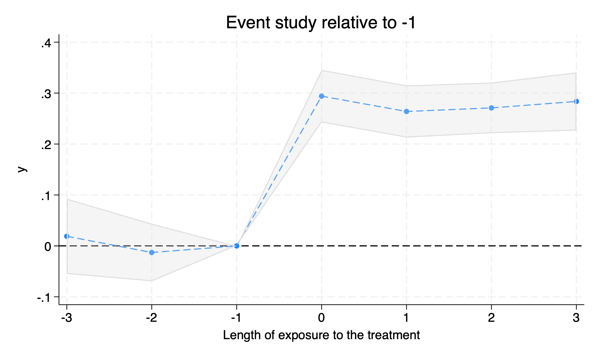

# `xt2treatments` estimates event studies with two treatments


# Syntax

- `xt2treatments` varname(numeric) [*if*], **treatment**(varname numeric) **control**(varname numeric), [**pre**(#) **post**(#) **baseline**(*string*) **weighting**(string) **cluster**(varname) **graph**]

`xt2treatments` estimates average treatment effects on the treated (ATT) when there are two treatments. The first treatment is the treatment of interest, and the second treatment is the control. 

The package can be installed with
```
net install xt2treatments, from(https://raw.githubusercontent.com/codedthinking/xt2treatments/main/) replace
```

# Options
## Options
Option | Description
-------|------------
**treatment** | Dummy variable indicating the treatment of interest.
**control** | Dummy variable indicating the control treatment.
**pre** | Number of periods before treatment to include in the estimation (default 1)
**post** | Number of periods after treatment to include in the estimation (default 3)
**baseline** | Either a negative number between `-pre` and `-1` or `average`, or `atet`. If `-k`, the baseline is the kth period before the treatment. If `average`, the baseline is the average of the pre-treatment periods. If `atet`, the regression table reports the average of the post-treatment periods minus the average of the pre-treatment periods. Default is `-1`.
**weighting** | Method to weight different cohorts in the estimation.
**cluster** | Variable to cluster standard errors. If not specified, the panel identifier is used.
**graph** (optional) | Plot the event study graph with the default settings of `hetdid_coefplot`.

## Weighting methods
Method | Description
-------|------------
**equal** (default) | Each cohort is weighted equally.
**proportional** | Cohorts are weighted linearly by the number of observations, (n0 + n1), where n0 is the number of controls, n1 is the number of treated units.
**optimal** | Cohorts are weighted by the inverse of the standard error of the treatment effect estimate of the cohort, (n0 * n1) / (n0 + n1).

# Examples
```
use "xt2treatments_testdata.dta", clear
```
```
xtset i t
```
```
xt2treatments y, treatment(treatmentB) control(treatmentA) pre(1) post(3) weighting(equal)
```


```
Panel variable: i (strongly balanced)
 Time variable: t, 1 to 10
         Delta: 1 unit

Event study relative to -1               Number of obs = 1,000

------------------------------------------------------------------------------
           y |       ATET   Std. err.      z    P>|z|     [95% conf. interval]
-------------+----------------------------------------------------------------
          -1 |          0  (omitted)
           0 |    .464904   .0179099    25.96   0.000     .4298014    .5000067
           1 |   .4581741   .0177579    25.80   0.000     .4233694    .4929789
           2 |   .4108288   .0173002    23.75   0.000     .3769211    .4447366
           3 |   .3221394      .0199    16.19   0.000     .2831362    .3611426
------------------------------------------------------------------------------
```

```
xt2treatments y, treatment(treatmentB) control(treatmentA) pre(3) post(3) weighting(optimal) graph
```

```
Panel variable: i (strongly balanced)
 Time variable: t, 1 to 10
         Delta: 1 unit

Event study relative to -1               Number of obs = 1,000

------------------------------------------------------------------------------
           y |       ATET   Std. err.      z    P>|z|     [95% conf. interval]
-------------+----------------------------------------------------------------
          -3 |   .0188954   .0377553     0.50   0.617    -.0551037    .0928944
          -2 |    -.01291   .0288885    -0.45   0.655    -.0695304    .0437105
          -1 |          0  (omitted)
           0 |   .2940147   .0263712    11.15   0.000     .2423281    .3457014
           1 |   .2639324   .0261562    10.09   0.000     .2126672    .3151977
           2 |    .270967   .0253986    10.67   0.000     .2211866    .3207474
           3 |    .283611    .029183     9.72   0.000     .2264135    .3408086
------------------------------------------------------------------------------
```



# Background
`xthdidregress` estimates ATT against various control groups. However, it does not allow for two treatments. 

When the control group is another treatment happening at the same time, the ATT is the difference between the treatment and the control. 

# Remarks
The command returns, as part of `e()`, the coefficients and standard errors. See `ereturn list` after running the command. Typical post-estimation commands can be used, such as `outreg2`, `estout`, or `coefplot`.

# Authors
- Miklós Koren (Central European University, https://koren.mk), *maintainer*

# License and Citation
You are free to use this package under the terms of its [license](https://github.com/codedthinking/xt2treatments/blob/main/LICENSE). If you use it, please cite the software package in your work:

- Koren, Miklós. (2024). XT2TREATMENTS - event study with two treatments [Computer software]. Avilable at https://github.com/codedthinking/xt2treatments
